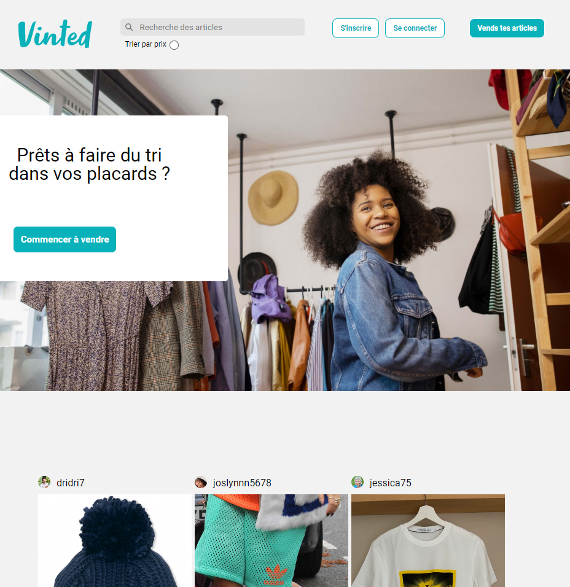

# Vinted

## Description

Ce projet est une réplique site web Vinted, où vous pouvez rechercher vos personnages et comics préférés. Il a été réalisé dans le cadre de ma formation au Réacteur. Ce projet a été developpé avec React pour le Front-End.

Il est composé des pages suivantes:

- Home page
- Login page
- Offer page
- Publish page
- Sign up page
  C'est un projet full-stack. Vous pouvez trouver le repo back-end [ici](https://github.com/ashmoune/vinted-backend).
  Le projet est hebergé sur Netlify, vous pouvez y accéder en suivant ce [lien](https://vintd.netlify.app/).

## Installation

1. Cloner ce repository.
2. Installer les dépendances du frontend et du backend en utilisant yarn install.
3. Lancer le projet en local avec yarn dev.
